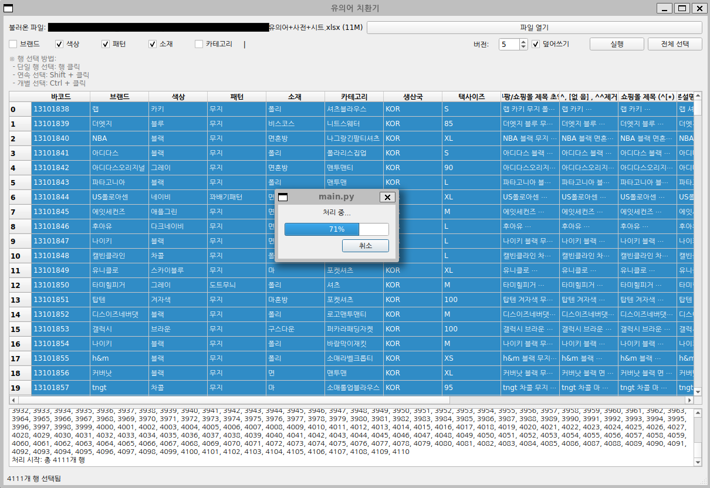
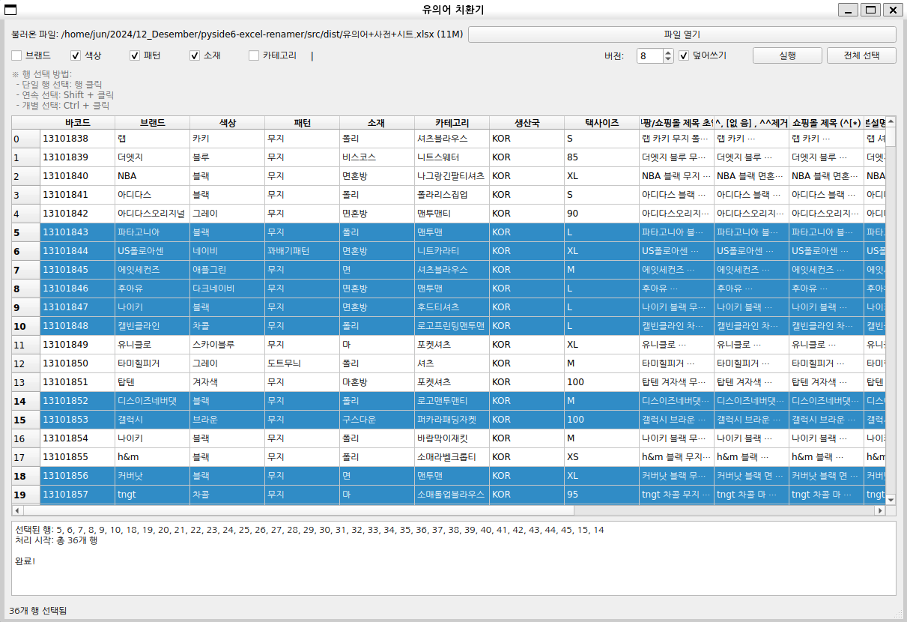

# Excel Synonym Replacer

엑셀 파일의 상품 정보를 활용하여 유의어를 자동으로 치환해 다양한 상품명을 생성하는 데스크톱 애플리케이션입니다.



## 프로젝트 개요

온라인 마켓, 쇼핑몰 등에서 상품 노출을 최적화하기 위해 동일 상품에 대해 다양한 검색 키워드를 포함한 여러 버전의 상품명을 생성해야 하는 경우가 많습니다. 이 도구는 엑셀 파일에 정리된 브랜드, 색상, 패턴, 소재, 카테고리 등의 유의어 사전을 활용하여 상품명을 자동으로 변환해줍니다.

### 실제 개발 배경

구제의류 쇼핑몰에서 상품 정보를 `<브랜드 + 색상 + 패턴 + 소재 + 카테고리>` 형식으로 조합하여 상품명을 생성하고 있었습니다. 예를 들어 `<ADIDAS + 블랙 + 스트라이프 + 면혼방 + 빅로고카라티셔츠>` 형태입니다.

여러 온라인 마켓에 동일한 상품을 등록할 때 검색 노출을 최적화하기 위해 다양한 상품명 변형이 필요했습니다:
- `<ADIDAS + 블랙 + 스트라이프 + 면혼방 + 빅로고카라티셔츠>` → 원본
- `<ADIDAS + 검정 + 줄무늬 + 코튼믹스 + 빅로고피케티>` → 유의어 변형

이러한 변환 작업을 수작업으로 하는 것은 많은 시간이 소요되고 대량의 상품에 적용하기 어려웠기 때문에 자동화 도구가 필요했습니다.

## 주요 기능

- **엑셀 파일 기반 작업**: 기존 엑셀 파일을 불러와 직접 수정
- **유의어 자동 치환**: 브랜드, 색상, 패턴, 소재, 카테고리별 유의어 사전 활용
- **다중 버전 생성**: 하나의 상품에 대해 최대 10개의 다양한 상품명 생성
- **선택적 처리**: 전체 또는 선택한 행만 처리 가능
- **설정 저장**: 사용자 설정 자동 저장 및 복원
- **전체 선택 기능**: 대량의 데이터를 한 번에 처리할 수 있는 전체 선택 옵션
- **불필요한 정보 제거**: '폴리', '무지', '패턴' 등 가독성을 저해하는 불필요한 정보 자동 제거

## 기술 스택

- **언어**: Python 3.8+
- **GUI**: PySide6 (Qt for Python)
- **데이터 처리**: pandas, openpyxl
- **개발 환경**: Windows 10/11 최적화 (Windows 7 호환 고려)

## 설치 방법

1. 저장소 클론 또는 다운로드
   ```
   git clone https://github.com/your-username/excel-synonym-replacer.git
   cd excel-synonym-replacer
   ```

2. 의존성 패키지 설치
   ```
   pip install -r requirements.txt
   ```

3. 애플리케이션 실행
   ```
   python src/main.py
   ```

## 사용 방법

### 기본 사용법

1. **파일 열기**
   - "파일 열기" 버튼을 클릭하여 엑셀 파일 선택
   - 엑셀 파일은 데이터 시트와 유의어 사전 시트를 포함해야 함

2. **옵션 설정**
   - 치환할 항목 선택: 브랜드, 색상, 패턴, 소재, 카테고리 중 선택
   - 생성할 버전 수 설정 (1~10)
   - 덮어쓰기 여부 설정

3. **처리할 행 선택**
   - 테이블에서 처리할 행 선택 (단일, 연속, 개별 선택 가능)
   - "전체 선택" 버튼으로 모든 행 선택 가능

4. **실행**
   - "실행" 버튼을 클릭하여 상품명 생성 시작
   - 하단 로그 영역에서 진행 상황 확인



### 유의어 사전 구성

엑셀 파일에 다음 시트를 포함해야 합니다:
- `브랜드`: 브랜드명과 유의어
- `색상`: 색상명과 유의어
- `패턴`: 패턴명과 유의어
- `소재`: 소재명과 유의어
- `카테고리`: 카테고리명과 유의어

각 시트는 다음 형식을 따라야 합니다:
- A열: 원본 단어
- B열 이후: 해당 단어의 유의어들 (유의어1, 유의어2, 유의어3 등)

예시:
- 검정 → 블랙, 흑색, 차콜블랙
- 면혼방 → 코튼믹스, 면소재, 면혼합소재

## 프로젝트 구조

```
excel-synonym-replacer/
├── src/                    # 소스 코드
│   ├── app.py              # 메인 GUI 애플리케이션
│   ├── dataframe_model.py  # 데이터 모델
│   ├── main.py             # 진입점
│   ├── synonym_extract.py  # 유의어 사전 추출
│   ├── synonyms_manager.py # 유의어 관리
│   ├── text_cleaner.py     # 텍스트 정제
│   ├── title_generator.py  # 상품명 생성
│   └── transform.py        # 데이터 변환
├── tests/                  # 테스트 코드
├── requirements.txt        # 의존성 패키지
└── README.md               # 이 파일
```

## 기술적 도전과 해결 과정

이 프로젝트 개발 과정에서 마주한 주요 도전 과제와 해결책:

1. **프롬프트 엔지니어링**: 유의어 생성을 위한 카테고리별 특화 프롬프트 설계와 토큰 최적화로 비용 효율적인 GPT API 사용
2. **조합 알고리즘**: 효율적인 유의어 조합 생성을 위한 인덱스 기반 알고리즘 개발 (브랜드, 색상, 패턴 등 최대 5개 요소의 조합)
3. **GUI와 성능**: 대량의 데이터를 처리하면서도 반응성 있는 UI 유지를 위한 배치 처리 및 비동기 처리 구현
4. **호환성 문제**: Windows 7 환경 지원을 위한 Qt 설정 및 라이브러리 최적화
5. **유의어 품질 관리**: "유사하면서도 너무 다르지 않은" 유의어 선정을 위한 도메인별 프롬프트 규칙 정교화

자세한 개발 과정과 문제 해결에 대한 내용은 [DEVELOPMENT.md](./DEVELOPMENT.md)를 참조하세요.

## 개발 과정의 도전 과제

개발 과정에서 다음과 같은 도전 과제가 있었습니다:

1. **유의어 사전 구축**
   - 대량의 유의어 생성 및 관리 문제
   - 브랜드, 색상, 패턴, 소재, 카테고리별 데이터 수집 및 정리

2. **다양한 운영 환경 지원**
   - Windows 7과 같은 구형 시스템 호환성 문제
   - Qt 라이브러리 버전 호환성 해결

3. **유의어 변환 품질 개선**
   - 유사하면서도 너무 다르지 않은 유의어 선택 문제
   - 변환 시 상품명의 가독성과 일관성 유지

4. **대용량 데이터 처리**
   - 수천 개 상품의 일괄 처리 성능 최적화
   - 메모리 사용량 최적화

## 개발 배경

온라인 상품 판매 시 검색 노출을 최적화하기 위해 동일 상품에 대해 다양한 키워드 조합의 상품명이 필요합니다. 수동으로 이 작업을 하는 것은 시간이 많이 소요되고 오류가 발생하기 쉽습니다. 이 도구는 이러한 작업을 자동화하여 시간을 절약하고 일관된 품질의 상품명을 생성할 수 있도록 개발되었습니다.

## 활용 사례

- **온라인 쇼핑몰**: 상품의 노출 빈도 증가를 위한 다양한 키워드 조합 생성
- **마케팅 담당자**: SEO 최적화를 위한 다양한 상품명 변형 생성
- **구제의류 판매**: 동일 상품을 여러 마켓에 다른 이름으로 등록
- **대량 상품 등록**: 상품 일괄 처리로 시간 절약

## 라이센스

MIT License
